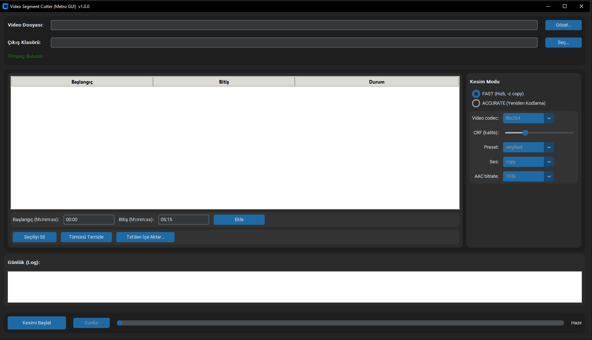

# Ebs Video Parça Kesici (Metro GUI) 🎬✨

**Ebs Video Parça Kesici**, videolarınızdan birden fazla zaman aralığını **hızlı** (stream copy) ya da **hassas** (yeniden kodlama) modlarla zahmetsizce kesmenizi sağlayan, **modern metro tarzı arayüz**e sahip bir masaüstü uygulamasıdır.



------------------------------------------------------------

## 🚀 Özellikler

- 🗂️ **Video seç** ve **birden çok** başlangıç/bitiş aralığı ekle  
- ⤵️ **Txt dosyadan içe aktar**: `00:00-05:15`, `0:00 to 5:15`, `0:00,5:15`, `0:00..5:15` vb.  
- 📁 **Çıkış klasörünü** belirle  
- ⚡ **HIZLI** mod: *stream copy* (keyframe’e hizalı, çok hızlı)  
- 🎯 **HASSAS** mod: *frame-accurate* (H.264/H.265 ile yeniden kodlama, daha yavaş)  
- 🔊 Ses için **copy** veya **AAC** (bitrate seçimi)  
- 📊 **Parça bazlı durum** + **genel ilerleme çubuğu**  
- 🧼 Temiz, **Metro benzeri arayüz** (customtkinter)

------------------------------------------------------------

## 🤔 Neden Ebs Video Parça Kesici?

- **Toplu iş**: Bir videodan birçok parçayı tek tıklama ile üretin  
- **Esneklik**: Hız vs. doğruluk dengesini siz seçin  
- **Basitlik**: FFmpeg komutlarını ezberlemeden görsel arayüzle çalışın  
- **Şeffaflık**: Çalışan FFmpeg komutları ve loglar görünür  
- **Taşınabilirlik**: Windows, macOS ve Linux’ta çalışır

------------------------------------------------------------

## 🛠️ Gereksinimler

- **Python 3.8+**  
- **FFmpeg** (PATH’te olmalı)
- Python bağımlılığı: `customtkinter`

### FFmpeg kurulumu
- **Windows**: https://ffmpeg.org → indirin → `bin` klasörünü PATH’e ekleyin  
- **macOS**: `brew install ffmpeg`  
- **Linux (Debian/Ubuntu)**: `sudo apt-get install ffmpeg`

------------------------------------------------------------

## 📦 Kurulum

```bash
git clone https://github.com/ebubekirbastama/ebs-video-parca-kesici.git
cd ebs-video-parca-kesici
python -m venv .venv
.venv\Scripts\activate   # Windows
source .venv/bin/activate  # Linux/Mac
pip install -r requirements.txt
```

`requirements.txt` içeriği:
```
customtkinter>=5.2.2
```

------------------------------------------------------------

## ▶️ Çalıştırma

```bash
python app.py
```

- Video dosyasını seçin  
- Zaman aralıklarını ekleyin (veya `.txt`’den içe aktarın)  
- **Kesim Modu**nu seçin: **HIZLI** veya **HASSAS**  
- **Kesimi Başlat**’a tıklayın  

Çıktı dosyaları şu formatta oluşur:  
`VIDEOADI_parcaXX_BASLANGIC_to_BITIS.mp4`

------------------------------------------------------------

## 📚 Kullanım İpuçları

- **HIZLI mod**: Çok hızlıdır; ama kesim noktası birkaç kare kayabilir.  
- **HASSAS mod**: Kare hassasiyetinde kesim yapar; daha yavaştır.  
- **CRF**: `18` ~ kayıpsız görsel kalite, sayı büyüdükçe kalite azalır.  
- **Preset**: `ultrafast` → en hızlı / `slow` → en küçük dosya.  
- **Ses**: Sorunlu seslerde `aac` + `192k` önerilir.

------------------------------------------------------------

## 📄 .txt Örnekleri

```
00:00-05:15
0:12 to 1:05
2:00,2:45
10:00..12:34
```

------------------------------------------------------------

## 🧪 Sorun Giderme

- **FFmpeg bulunamadı** → PATH ayarlarını kontrol edin  
- **HIZLI mod kayma yapıyor** → HASSAS mod seçin  
- **Çıktı oynatılmıyor** → HASSAS + `libx264` + `aac` deneyin  
- **Zaman hatası** → Format: `hh:mm:ss`, `mm:ss` veya `ss(.ms)`

------------------------------------------------------------

## 📈 Yol Haritası

- ⏳ ETA tahmini  
- 🧵 Paralel parça işleme  
- 🧩 Şablon/ön ayar kaydetme  
- 🏷️ Çıktı dosya adı özelleştirme  
- 🌐 Çoklu dil desteği  


